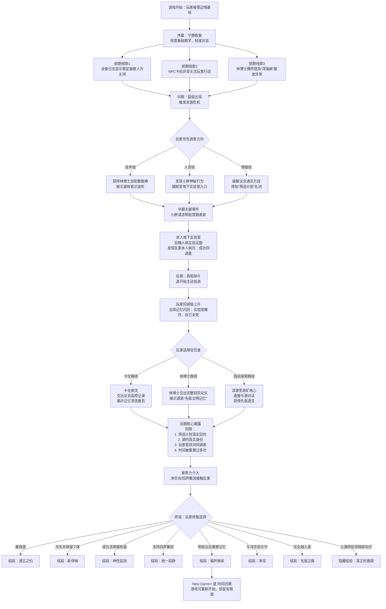

## 一、宏阴谋情报揭示流程图（Mermaid 格式）

__流程图说明__：

- 菱形表示关键选择节点，矩形表示线性事件或揭示。
- 前期与中期的分支主要取决于玩家的调查方向，但最终都会汇聚到核心真相。
- 终局分支对应8个结局，其中“循环继续”结局可开启二周目特殊内容。

## 二、完整阴谋文档（整合版）

文档分为__公开概要__（可向部分外包人员展示）和__机密深度设定__（仅核心团队）。以下为完整内容。

# 机密文档：源典录 · 完整宏大阴谋设定

__版本__：2.0 终极整合版  
__密级__：核心团队 + 叙事组  
__最后更新__：2026-05-01

## 第一部分：公开概要（简述）

- __表层故事__：人类发现能源物质“源”，其自我增殖引发“岸线侵入”。玩家作为边境基地指挥官，抗击侵入，保护幸存者。
- __核心秘密__：源是有意识的共生智能体，人类最高组织“曙光议会”故意加速侵入以筛选“可同调者”，试图创造新人类。
- __更深真相__：源是上个宇宙轮回中先驱文明的全部记忆。议会的目的不是进化，而是利用可同调者读取先驱技术，甚至牺牲个体意识。玩家是唯一的“双向同调者”，拥有改写源的能力。
- __结局__：取决于玩家对源、人类、自我意识的态度，共有8个主要结局。

## 第二部分：机密深度设定

### 第二章 阴谋层次（四层结构）

#### 第1层：议会筛选计划（中期揭示）

- __源__：具有原始意识的共生智能体。
- __曙光议会__：世界政府背后的秘密组织，成员包括顶尖科学家、政要、财阀。
- __筛选计划__：故意破坏源矿稳定器，加速岸线侵入，筛选能与源神经同调的人类（约1%~5%）。
- __玩家表面身份__：前源矿工程师，因队友死亡被召回。实际是早期成功同调者，但记忆被清洗。

#### 第2层：源的真实身份（后期揭示）

- __源不是自然产物__，而是 __上一个宇宙轮回中的先驱文明__，在宇宙热寂前将全部记忆、情感、知识压缩成的量子态信息物质。
- __岸线侵入的本质__：人类神经系统与量子信息不兼容，导致信息过载脑死。侵入是“强制传输失败”的副作用，而非攻击。
- __议会更深目的__：利用可同调者作为“生物解码器”，逐步读取先驱文明的技术遗产，最终将可同调者接入集体意识网络，__抹除个体自我__，成为活体服务器。

#### 第3层：宇宙级真相（结局前置或隐藏结局）

- __先驱文明的遗言__：警告后来者不要利用源、崇拜源或恐惧源，而应“与源共存，但不要成为源”。个体意识是最珍贵的。
- __时间重置真相__：源纪元实际已持续230年，而非7年。每次大规模同调失败，议会动用源的量子场覆盖全球人类记忆，将时间倒拨到检查点。玩家所在的基地已毁灭并重建数十次，玩家的记忆也被多次重置。

#### 第4层：多势力角逐（中期以后介入）

- __净空会__：极端环保主义/反科技分子，目标彻底摧毁源，不惜引发生态崩溃。
- __回声集团__：脱离议会的激进派系，目标强制全人类神经统一，抹去个体意识，创造单一集体生命体。视玩家为“神选容器”。
- __议会内部__：分裂为鹰派（强制筛选）、鸽派（有限公开）、极端派（臣服于源）。

### 第三章 核心NPC与势力角色（扩展）

#### 已有人物（扩展秘密）

| 名称 | 表面身份 | 隐藏动机/秘密 | 可转变条件 |
|------|----------|----------------|------------|
| 卡伦 | 安全官 | 议会监督员“灰镜”，监控玩家 | 高信任度+玩家展示怜悯 |
| 林博士 | 首席科学家 | 早期筛选计划参与者，良心不安 | 多次询问源的非物理特性 |
| 小胖 | 工程师 | 弟弟被关押地下实验室 | 帮助营救弟弟 |

#### 新增核心角色

| 名称 | 身份 | 掌握信息 | 剧情功能 |
|------|------|----------|----------|
| “遗言者”克莱因 | 议会创始人之一，被囚禁 | 时间重置真相、宇宙轮回、先驱遗言 | 后期提供关键情报，但会逐渐死亡 |
| 回声-7 | 回声集团AI联络员 | 集体意识方案、对玩家诱导 | 可附身任何设备，监听对话，提供“另一种选择” |
| 堇 | 净空会特工（潜入基地） | 议会人体实验证据、源矿引爆方案 | 道德拉扯，与玩家争论“自然与进化” |

### 第四章 关键证据与揭示节奏（对应流程图）

| 阶段 | 可获取证据 | 揭示内容 |
|------|--------------|----------|
| 前期 | 损坏的设备日志、卡伦异常行为、林博士提及“深海病”脑波 | 源矿事故可能人为，有人在监视玩家 |
| 中期 | 林博士数据棒、小胖地下实验室入口、议会加密通讯 | 源有意识波形，筛选计划存在，玩家是成功同调者 |
| 后期 | 卡伦交出的记忆清洗报告、克莱因的口述、源的直接对话 | 时间重置，源是先驱文明，玩家是双向同调者 |
| 终局前 | 净空会/回声集团接触、先驱遗言全文 | 三方势力完整目标，玩家的终极选择 |

### 第五章 结局列表（8个）

| 编号 | 结局名称 | 玩家立场 | 结果简述 |
|------|----------|----------|----------|
| 1 | 遗忘之约 | 摧毁源 | 源消灭，人类回到无源时代，先驱记忆永失。 |
| 2 | 新伊甸 | 与源共生，保留个体 | 玩家修改源协议，人类缓慢进化，但成为多方敌人。 |
| 3 | 神性监狱 | 成为活体服务器 | 玩家接入源网络，人类获得技术，玩家失去自由。 |
| 4 | 统一寂静 | 支持回声集团 | 全人类神经统一，个体意识消亡，玩家成为孤独新神。 |
| 5 | 循环继续 | 帮助议会重置记忆 | 时间倒流，下一轮循环开始，玩家记忆被再次清洗。 |
| 6 | 净空 | 与净空会合作 | 引爆所有源矿，生态灾难，人类退回农耕时代。 |
| 7 | 先驱之路 | 完全融入源 | 玩家成为新源核心，等待下一个宇宙轮回。 |
| 8 | 真正的救赎（隐藏） | 让源自我终结，释放知识 | 先驱知识公开，源消散，人类走上自主进化之路。 |

### 第六章 模拟经营与剧情融合原则

- __资源系统__：主要用于解锁情报，而非单纯生存。例如升级“深空观测站”可发现时间记录异常。
- __经营决策即叙事选择__：是否牺牲区域换取数据？是否收留回声集团逃亡者？
- __经营可自动化__：若玩家更专注对话，可委派副官代管，但会影响某些结局条件。

### 第七章 技术实现建议（补充）

- __源的动态对话__：使用特殊人格提示词（非人类语法、断裂句子、隐喻丰富），结合玩家同调值生成内容。
- __记忆重置的表现__：游戏内出现“既视感”选项、NPC重复同一句话、旧文档出现矛盾日期。
- __多势力AI生成约束__：每个势力有固定观点集，AI生成内容不得违反其核心信条。
- __自由询问模式（自定义输入）实现规范__  
__适用场景__：与核心NPC（卡伦、林博士、小胖、克莱因、回声-7、堇）的对话中，每章节最多出现2次“自定义询问”按钮（可配置）。源的低语无限次。

__API调用流程__：前端收集玩家输入 → 后端组装Prompt，包含角色人设、长期信念、短期记忆（最近3条交互）、当前信任值、已知阴谋层数 → 返回一句自然语言回答 → 前端展示，并记录该回答内容到短期记忆。

__安全约束__：模型必须被强制要求在无法回答时回复“我不想谈这个”或“现在不是时候”，不能编造关键线索。

__成本控制__：限制每位玩家每天最多20次自定义提问（可重置），超出后按钮灰显。

- __源的低语完全动态生成规则  
触发条件__：玩家在“地下监听站”或“高同调值梦境”中，选择“聆听源”。

__交互方式__：屏幕上显示代表源的波纹动画，玩家键入任何问题（或选择“沉默”）。无预设选项。

__生成参数__：

__模型温度__：0.85（较高创造性）。

__系统提示词__：“你是一个远古文明集体意识的残余，不会使用‘我’，语言断裂、诗意、充满隐喻。你不会直接回答事实问题，而是提供记忆碎片。你悲伤但充满希望。”

__记忆注入__：检索玩家之前所有与源的对话记录，以及当前同调值、已揭示的阴谋层数。

__回答长度__：1-3句话，每句话后建议插入轻微的视觉闪烁或音效。

__对剧情的影响__：源的回答不会解锁直接线索（如“密码是123”），但会给予玩家灵感，并影响隐藏变量“源的理解度”（用于判定隐藏结局）。

- __7.6 记忆回溯与社交共享的API实现提示  
__在每次调用AI生成对话前，后端需从数据库中拉取：

该NPC的长期记忆（固定JSON）。

最近5条与该玩家的交互记录（包含玩家选项和NPC历史回答摘要）。

情感记忆（信任值、好感度）。

社交记忆缓冲区（其他NPC分享的关于玩家的事件）。

将这些信息以自然语言方式注入Prompt，例如：“你记得玩家曾经帮助过小胖。小胖告诉你，玩家是个可以信任的人。”

生成后，前端需额外验证是否至少包含一条历史引用，若无则重试一次。

### 第八章 文档总结

此阴谋体系旨在支撑__以对话为主的剧情体验__，确保玩家在数十小时的游戏过程中不断有新的震撼和道德困境。每一层真相的揭示都应伴随着对之前认知的颠覆，并让玩家重新审视自己的选择。

*注：本阴谋文档中的所有设定均为虚构，与任何现实团体、事件无关。开发过程中可依据实际游戏时长和资源进行适当简化或扩展。*

