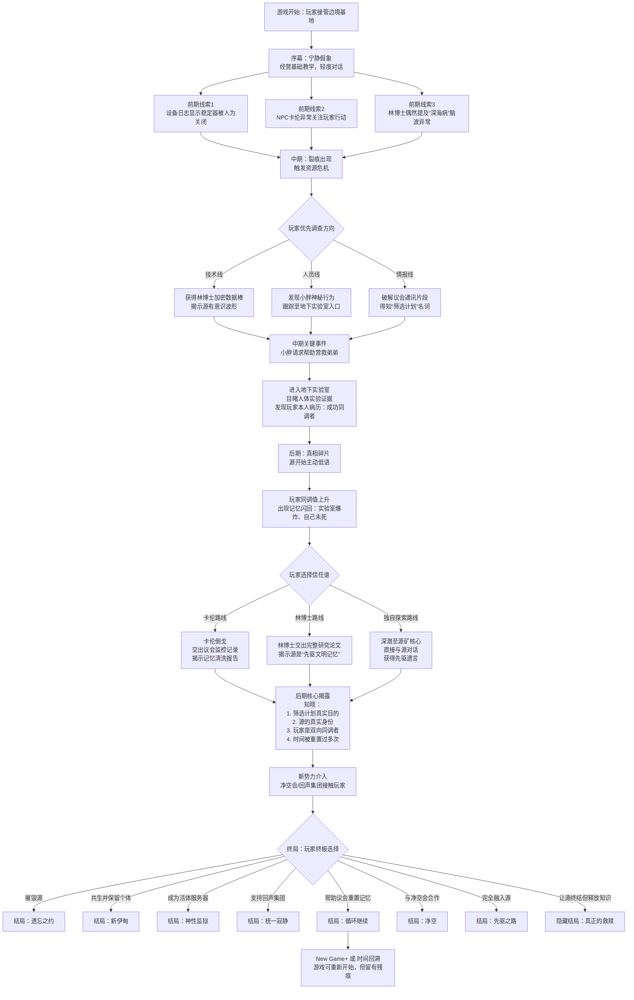

# 源纪元 · 岸线侵入

**版本**：1.0（完整整合版）  
**最后更新**：2026-05-01

## 一、游戏概述

### 1.1 基本信息

- **游戏类型**：AI驱动的叙事类游戏，核心为**对话类 RPG + 轻模拟经营**
- **叙事占比**：剧情对话约占70%，模拟经营约占30%
- **核心特色**：
  - 核心NPC由AI驱动，拥有独立的记忆、人设、隐藏动机，行为与对话动态生成
  - 玩家的每个选择（对话或经营）都会影响剧情走向、NPC关系及最终结局
  - 模拟经营系统轻量化，主要用于触发剧情分支和表达玩家立场
  - 剧情采用“多层阴谋”结构，从自然灾难逐步揭示宇宙级真相

### 1.2 目标平台

- 暂无

### 1.3 玩家体验目标

- 体验一个充满道德困境、哲学思辨和情感冲击的科幻故事
- 通过与AI NPC的深度对话，感受真实的人际关系与背叛
- 通过有限的经营决策，体验“选择与代价”的沉重感
- 多结局重玩价值

**1.4 AI融合特色（增强玩家感知）**  
为让玩家真切感受到“NPC由AI驱动且拥有独立记忆”，游戏在以下维度强化AI存在感：

- 记忆回溯对话：NPC会主动引用过往交互（如“你上次帮了我，我记得”），每次对话至少包含一次对最近3-5条历史记录的引用。
- 记忆碎片界面：角色档案中动态显示NPC对玩家的关键印象（如“卡伦觉得你是个心软的人”），随玩家选择实时更新。
- 情绪化语言渐变：信任值高低直接影响NPC的措辞风格（高信任时卡伦会软化命令式语气）。
- 自由文本输入（可选）：在关键对话节点，玩家可输入自定义问题，AI实时生成符合该NPC记忆的回答（每章限次，不提供核心线索）。
- 社交记忆共享：NPC之间会谈论玩家，事件影响力在NPC社交网络中传播（如帮助小胖后，林博士也会间接增加信任）。
- 动态临时NPC：在非主线地点随机生成难民、商人等临时角色，完全由AI驱动，拥有短期记忆，与玩家短暂互动后离开。
- 源的低语：完全由AI实时生成，无预设选项，玩家可自由提问，源会记住玩家的问题并在后续交流中引用。

这些设计在不增加开发复杂度的前提下，让AI从“后台技术”变为“可玩体验”。

## 二、世界观与剧情设定

### 2.1 表层剧情（玩家初始认知）

- **时代**：公元2125年，源纪元。人类在海底发现可自我增殖的能源物质“源”，实现科技爆发。
- **灾难**：源在深海疯狂增殖，破坏源矿机，向大陆蔓延，称为“岸线侵入”。
- **应对**：人类在全球建立基地，组成最高组织“曙光议会”抗击侵入。
- **玩家角色**：前源矿工程师，因一次事故失去队友，被紧急召回担任边境基地代理指挥官。

### 2.2 深层阴谋（四层结构）

| 层次 | 揭示时机 | 核心真相 |
|------|----------|----------|
| 第一层（议会阴谋） | 游戏中期 | 源是有意识的共生体；曙光议会故意加速岸线侵入以筛选“可同调者”，创造新人类。 |
| 第二层（源的真实身份） | 游戏后期 | 源是上个宇宙轮回中先驱文明的全部记忆与情感凝聚体。岸线侵入是信息过载的副作用。 |
| 第三层（宇宙级真相） | 结局前置或隐藏 | 源纪元实际已持续230年，人类记忆被多次重置；玩家是唯一的“双向同调者”，可改写源。 |
| 第四层（多势力角逐） | 中后期介入 | 净空会（摧毁源）、回声集团（强制统一意识）、议会内部分裂，玩家需周旋或联合。 |

### 2.3 剧情节奏与揭示流程

下面的流程图概括主线节奏、调查方向分支与终局结局（由原文档导图整理为 Mermaid，便于版本维护）。

**流程图说明**：

- 菱形表示关键选择节点，矩形表示线性事件或揭示。
- 前期与中期的分支主要取决于玩家的调查方向，但最终都会汇聚到核心真相。
- 终局分支对应8个结局，其中“循环继续”结局可开启二周目特殊内容。

与文字大纲对应的关键节点：

- **序幕**：熟悉基地、基础教学
- **前期**：发现设备异常、NPC暗示
- **中期**：获得证据（数据棒、地下实验室）、得知筛选计划
- **后期**：源的低语、记忆闪回、接触克莱因
- **终局**：三方势力接触、玩家做出终极选择

## 三、关键人物（AI驱动角色）

### 3.1 边境基地阵营

| 角色 | 表面身份 | 隐藏身份 | 核心秘密 | 可转变条件 |
|------|----------|----------|----------|------------|
| **卡伦** | 安全官 | 议会监督员“灰镜” | 监控玩家，可执行清理 | 高信任度 + 玩家展现怜悯 |
| **林博士** | 首席科学家 | 前筛选计划参与者 | 知道玩家是同调者 | 多次保护科研选择 |
| **小胖** | 工程师 | 弟弟被关押 | 偷能源维持弟弟生命 | 帮助营救弟弟 |

### 3.2 深层真相持有者

| 角色 | 身份 | 掌握信息 | 出现条件 |
|------|------|----------|----------|
| **克莱因** | 议会创始人之一，被囚禁 | 时间重置、宇宙轮回、玩家真正历史 | 地下实验室线索 + 卡伦或林博士帮助 |
| **回声-7** | 回声集团AI | 集体意识方案 | 同调值>30%，任何屏幕 |
| **堇** | 净空会特工 | 议会人体实验证据、引爆方案 | 玩家多次拒绝源升级 |

### 3.3 幕后势力代表

| 角色 | 身份 | 出现形式 |
|------|------|----------|
| **伊丽莎白·莫罗** | 曙光议会主席 | 远程通信/全息影像 |
| **先知** | 回声集团领袖 | 仅通过回声-7传递信息 |
| **老榕树** | 净空会领袖 | 仅特定结局出现 |

### 3.4 特殊存在：源

- **本质**：先驱文明记忆的量子凝聚体
- **表现形式**：低语、幻觉、环境异常
- **语言风格**：断裂、隐喻、非人类语法
- **功能**：提供真相碎片，影响同调值

## 四、核心玩法系统

### 4.1 对话系统（AI驱动）

- **机制**：玩家从2-4个选项中选择，影响NPC记忆、信任值、隐藏变量
- **AI生成**：每个NPC根据记忆分层（长期/短期/情感/动态）实时生成对话内容
- **纠偏机制**：
  - 软纠偏：NPC情绪反馈引导玩家
  - 硬纠偏：关键事件强制触发
  - 叙事漏斗：关键节点选项有限，非关键节点自由发挥

### 4.2 模拟经营系统（轻量化）

#### 资源（4种）

- **能源**（源）：维持防御、升级建筑
- **食物**：养活人口
- **医疗物资**：治疗伤员、稳定同调
- **情报点**：解锁真相

#### 核心设施与决策

| 设施 | 关键决策 | 叙事后果 |
|------|----------|----------|
| 通讯阵列 | 加密模块 vs 广播系统 | 破译议会密文 / 吸引净空会 |
| 源矿机 | 加大开采 vs 限制开采 | 加速岸线侵入 / 延缓同调 |
| 医疗实验室 | 神经扫描仪 vs 同调抑制器 | 发现卡伦秘密 / 降低同调值 |
| 防御工事 | 升级至坚固 | 减缓侵入，但吸引回声集团 |
| 地下监听站 | 建造并启用 | 获得源的低语，提升同调值 |

#### 经营决策映射表

详见 `management_sim_design.md`（《模拟经营设计草案》）第一篇《经营决策与剧情事件映射表》。每个决策触发特定剧情事件，改变NPC信任值和解锁新对话。

#### 委任系统

- 玩家可委任卡伦（侧重防御）或林博士（侧重科研）代管基地
- 后果：被委任者信任值上升，但玩家失去部分控制

### 4.3 岸线侵入系统

- **可视化**：地图红色边界，随时间推进
- **推进条件**：固定时间 + 玩家加大开采源
- **后果**：失去区域、NPC死亡、触发撤离路线
- **减速方式**：升级防御、限制开采、与净空会合作

### 4.4 多结局系统

共有8个主要结局，由玩家在终局的选择及隐藏变量（同调值、人性值、势力倾向等）决定：

| 序号 | 名称 | 简要描述 |
|:---:|:---|:---|
| 1 | 遗忘之约 | 摧毁源，人类失去未来技术可能 |
| 2 | 新伊甸 | 与源共生，保留个体意识，成为桥梁 |
| 3 | 神性监狱 | 成为活体服务器，人类获得知识，玩家失去自由 |
| 4 | 统一寂静 | 强制全人类神经统一，个体意识消亡 |
| 5 | 循环继续 | 帮助议会重置记忆，进入下一轮循环 |
| 6 | 净空 | 引爆源矿，生态灾难，退回农耕时代 |
| 7 | 先驱之路 | 融入源，等待下一个宇宙轮回 |
| 8 | 真正的救赎（隐藏） | 源自我终结，释放知识，人类自主进化 |

## 五、技术实现建议

### 5.1 AI对话生成架构

| 层级 | 功能 | 实现方式 |
|------|------|----------|
| 剧情蓝图 | 固定主线结构 | 预编写关键节点（开场、转折、高潮、结局） |
| AI填充层 | 生成细节对话/描述 | GPT/Llama + 人格提示词 + 记忆检索 |
| 验证层 | 检测人设与逻辑 | 规则引擎 + 小模型评分 |
| 纠偏层 | 偏离时修正或重试 | 回退到预生成内容或触发硬纠偏 |

### 5.2 NPC记忆结构

- **长期记忆**：不可变（世界观、背景、信念）
- **短期记忆**：最近3-5次交互
- **情感记忆**：信任值、好感度、恐惧值
- **动态记忆**：玩家造成的变化（如“曾被玩家救助”）

### 5.3 源的AI生成规则

- 提示词要求：非人类语法、断裂句子、不使用第一人称单数、大量隐喻
- 输出长度：通常1-3句话
- 触发条件：玩家在监听站、受损源矿机或高同调值下的梦境

## 六、游戏流程与时长估算

### 6.1 阶段划分

- **序幕**（约1小时）：教学、建立基地、认识NPC
- **前期**（约4-6小时）：资源管理、发现异常线索
- **中期**（约6-8小时）：揭示筛选计划、接触地下实验室、势力介入
- **后期**（约4-6小时）：接触克莱因、源的低语、记忆闪回
- **终局**（约2小时）：三方势力选择、最终结局

**总游戏时长**：约17-23小时（单周目）

### 6.2 重玩价值

- 不同选择导致不同结局和NPC命运
- “循环继续”结局可开启二周目特殊内容（保留部分记忆残痕）
- 隐藏结局需要特定条件组合

## 七、开发优先级建议

| 阶段 | 核心内容 | 关键产出 |
|------|----------|----------|
| 第一阶段（原型） | 基础对话系统、1-2个NPC（卡伦、林博士）、简单资源系统 | 可玩demo，验证AI生成 |
| 第二阶段（核心） | 完整阴谋主线、所有NPC、经营决策映射、岸线侵入 | 垂直切片 |
| 第三阶段（扩展） | 多结局、隐藏内容、二周目、润色 | 完整游戏 |

## 八、附录：文档索引

本目录英文文件名对照（Git/协作时便于引用路径）：

- `gdd_master_outline.md`：本「游戏设计大纲 / 完整整合版」（原《大纲》）。
- `conspiracy_lore_codex.md`：《阴谋文档》/ 源典录整合与宏观流程图。
- `npc_bible_ai_characters.md`：《关键人物设定总览》（AI 驱动 NPC）。
- `management_sim_design.md`：《模拟经营系统设计文档》（含决策—剧情映射表）。
- `sim_framework_index.md`：静默运营与模拟层的**文档总入口**。
- `sim_facility_tech_and_resource_gameplay.md`：**设施升级树（DAG）**与**四类资源的地图主动玩法**契约规格。
- `player_variables_endings_matrix.md`：《玩家变量与结局条件表》。
- `critical_dialogue_nodes_blueprint.md`：《对话节点表（关键节点骨架）》。
- `narrative_structure_blueprint_2026-05-08.md`：《剧情结构文档（叙事蓝图）》。
